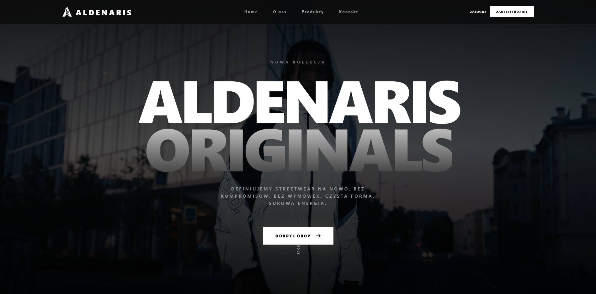
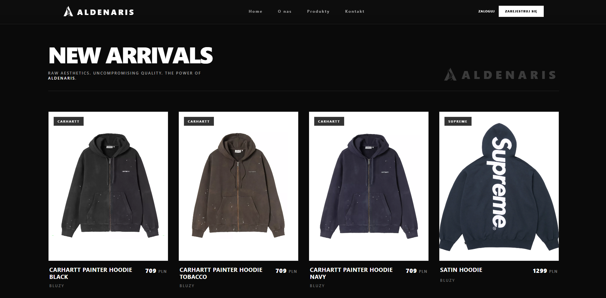
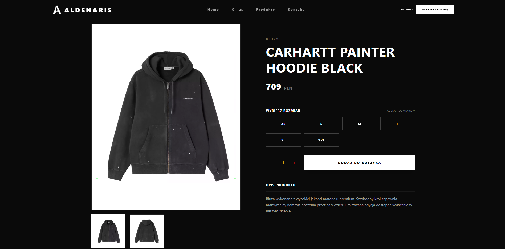
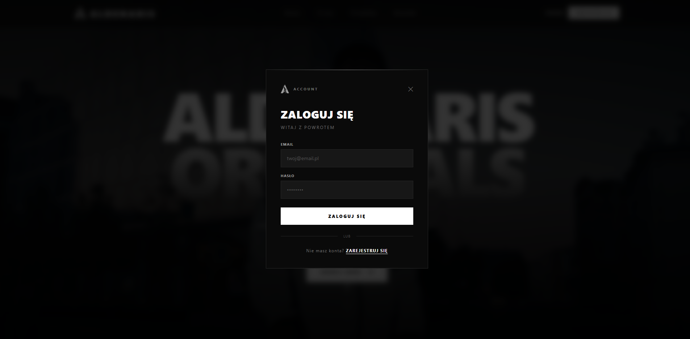

# 🪐 ALDENARIS Streetwear Shop

ALDENARIS to nowoczesna platforma e-commerce typu premium, dedykowana modzie ulicznej (streetwear). Projekt charakteryzuje się mroczną, luksusową estetyką, wysoką wydajnością oraz płynnym User Experience.


## 🚀 Kluczowe Funkcje

- **Premium UI/UX**: Mroczny, minimalistyczny design z szerokim trackingiem i wysokim kontrastem.
- **Dynamiczny Katalog**: Przeglądanie produktów z płynnymi efektami hover i animacjami.
- **Szczegóły Produktu**: Pełna galeria zdjęć, wybór rozmiaru, kontrola ilości i inteligentny system cache'owania.
- **System Autentykacji**: Logowanie i rejestracja zintegrowane z globalnym stanem (Zustand).
- **Persystencja Danych**: Stan zalogowanego użytkownika jest zapamiętywany po odświeżeniu strony (localStorage).
- **Inteligentna Nawigacja**: Płynne przewijanie do sekcji na stronie głównej oraz inteligentne powroty z widoków szczegółowych.
- **Responsive Web Design**: Pełna optymalizacja dla urządzeń mobilnych, tabletów i desktopów.

## 📸 Screeny (Placeholders)

| Strona Główna | Produkty | Detale Produktu | Logowanie |
|---|---|---|---|
|  |  |  |  |

---

## 🛠 Technologie i Biblioteki

### Frontend
- **React 19** + **TypeScript**: Solidna podstawa typowana.
- **Vite**: Ultra-szybki bundler i środowisko deweloperskie.
- **Tailwind CSS v4**: Najnowocześniejsza wersja frameworka CSS do budowy UI.
- **Zustand**: Lekkie i wydajne zarządzanie stanem globalnym (Auth, UI).
- **TanStack Query (React Query) v5**: Zaawansowane zarządzanie danymi asynchronicznymi i cache'owaniem.
- **React Router v7**: System routingu z obsługą dynamicznych ścieżek.
- **Axios**: Klient HTTP do komunikacji z API.
- **React Hot Toast**: Eleganckie powiadomienia systemowe.

### Backend (Mock API)
- **JSON Server**: Pełne, udawane API REST działające na pliku `db.json`.

---

## 🏗 Architektura Projektu

Projekt podąża za zasadami **Feature-Sliced Design (FSD)** (uproszczonymi), co pozwala na łatwe skalowanie aplikacji.

```
src/
├── api/              # Globalna konfiguracja axios (interceptory)
├── assets/           # Statyczne zasoby (logo, ikony)
├── features/         # Logika biznesowa podzielona na moduły
│   ├── auth/         # Logowanie, Rejestracja, Store, Hooki
│   └── products/     # Katalog, Detale, Hooki, API
├── layout/           # Globalne komponenty strukturalne (NavBar, Footer)
├── store/            # Globalne magazyny Zustand
└── types/            # Globalne definicje typów TypeScript
```

---

## 📡 Dokumentacja API

Backend oparty jest o `json-server` uruchomiony na porcie `3001`.

### Produkty
- `GET /products` - Pobiera listę wszystkich produktów.
- `GET /products/:id` - Pobiera szczegóły konkretnego produktu.

### Użytkownicy
- `GET /users?email=...&password=...` - Wykorzystywane do prostego logowania.
- `POST /users` - Rejestracja nowego użytkownika.
- `GET /users?email=...` - Sprawdzanie dostępności adresu email.

---

## ⚙️ Instalacja i Uruchomienie

### 1. Klonowanie repozytorium
```bash
git clone https://github.com/twoj-profil/aldenaris-shop.git
cd aldenaris-shop
```

### 2. Uruchomienie Backend (Mock API)
```bash
cd backend
npx json-server --watch db.json --port 3001
```

### 3. Uruchomienie Frontend
W nowym oknie terminala:
```bash
cd frontend
npm install
npm run dev
```

---

## 📝 Do zrobienia (Future Enhancements)
- [ ] Implementacja pełnego Koszyka Zakupowego.
- [ ] Integracja z systemem płatności (Stripe/PayPal).
- [ ] Panel Admina do zarządzania asortymentem.
- [ ] Wielojęzyczność (i18next).
- [ ] Tryb jasny (Light Mode).

---

🚀 **Aldenaris** - Streetwear of the future.
